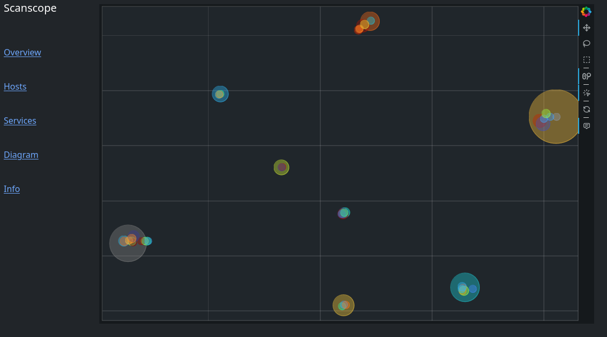

Scanscope
=========

Visualize portscan results



What the Eff?
-----------

In short: We interpret a host as a point in a vector space with 2\*\*32
dimensions over F_2.  Each dimension corresponds to a TCP- or UDP-port and has
either value 0 or 1, depending on its state. Then we apply a dimensionality
reduction technique named UMAP to project the data onto two dimensions.

Each circle in the plot corresponds to one group of hosts. The size of the
circle is related to the size of the group. Hosts with the same port
configuration are grouped together. Similar groups should be close by. The
colors mean nothing - except for gray: no open ports.

Installation
------------

```
$ pipx install git@git.syss.intern:avollmer/Scanscope.git
```

Usage
-----

```
$ scanscope nmap_output.xml -o result.html
```

Hint: The more ports you scan, the better this should work.

I recommend scanning at least the top 100 ports, so: `nmap -T4 -sS -F -oX
nmap_output.xml -iL input.txt`. Service scans or script scans do not help.
Scanning the top 1000 ports or even all ports however, does.

Help
----

Read `scanscope -h`
