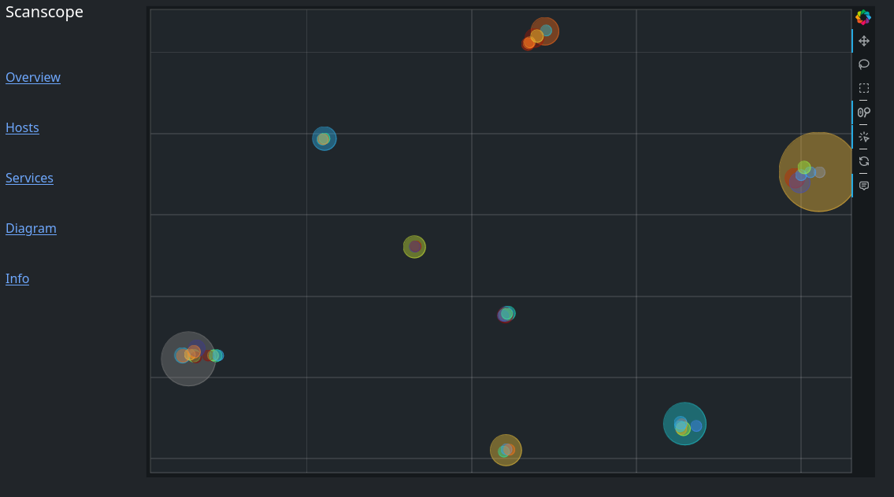

Scanscope
=========

Visualize port scan results in a self-contained HTML file.



What is this bubble chart?
--------------------------

In short: We interpret a host as a point in a vector space with 2^17
dimensions over F_2.  Each dimension corresponds to a TCP- or UDP-port and has
either value 0 or 1, depending on its state. Then we apply dimensionality
reduction techniques to project the data onto two dimensions.

Each circle in the plot corresponds to one group of hosts. The size of the
circle is related to the size of the group. Hosts with the same port
configuration are grouped together. Similar groups should be close by. The
colors mean nothing - except for gray: no open ports. The coordinates are
also not meaningful and can change with a new run.

Installation
------------

If you require instructions on how to install a standard Python package, I
recommend you use [`uv`](https://docs.astral.sh/uv/getting-started/installation/):

```console
# Using uv (recommended):
uv tool install git+https://github.com/SySS-Research/Scanscope.git

# Alterantively, using pipx:
pipx install git+https://github.com/SySS-Research/Scanscope.git
```

Unfortunately, the requirements (in particular the machine learning
dependencies including `numpy` and `pandas`) are quite heavy with almost
600MB, so be prepared.

Usage
-----

Convert nmap output in XML to HTML:

```console
scanscope nmap_output.xml -o scanscope.html
```

Hint: The more ports you scan, the better this should work.

I recommend scanning at least the top 100 ports, so: `nmap -T4 -sS -F -oX
nmap_output.xml -iL input.txt`. Service scans or script scans do not help.
Scanning the top 1000 ports or even all ports however, does.

For more infomation, read the output of `scanscope -h`.

Parameter Optimization
----------------------

For advanced users who want to tune the parameters for optimal visualization
quality, an optional optimization module is available. This uses Bayesian
optimization to automatically find the best parameters for your specific dataset.

Install the optimization dependencies:

```
$ uv sync --group optimize
```

Run the optimization:

```
$ uv run examples/optimize_umap.py nmap_output.xml --trials 50
```

See [examples/README.md](examples/README.md) for detailed usage instructions.

License and copyright
---------------------

MIT licensed, developed by Adrian Vollmer, SySS GmbH.
